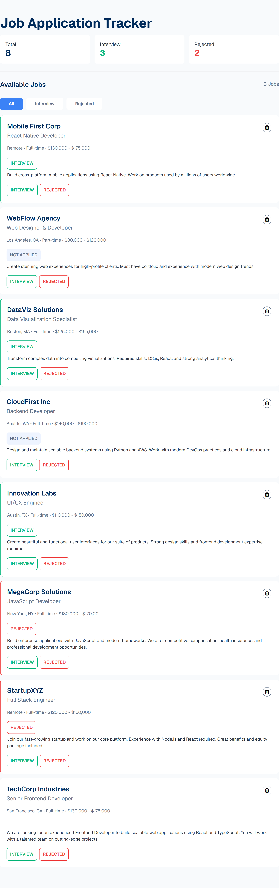
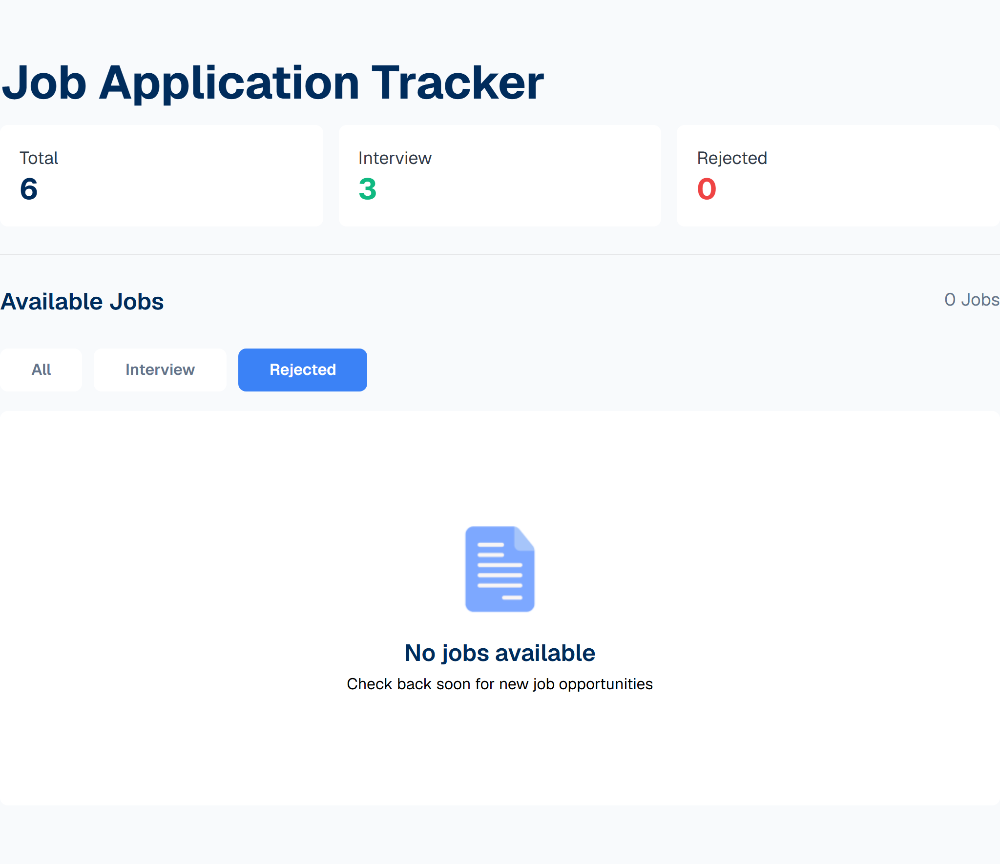
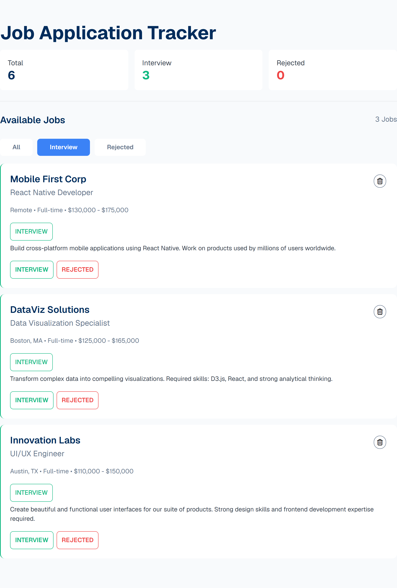

# Job Application Tracker

A clean, interactive job application tracker built with vanilla JavaScript and Tailwind CSS. Track your job applications, mark them as interviewed or rejected, and stay organized during your job hunt.

🔗 **Live Demo:** https://farhansm01.github.io/Job-Tracker/

---

## Features

- View all job listings in one place
- Mark jobs as **Interview** or **Rejected**
- Filtered views — All / Interview / Rejected
- Live score counters for each category
- Delete jobs from the list
- Color-coded cards with left border indicators
- Responsive design for mobile and desktop

---

## Tech Used

- HTML5
- CSS3
- Tailwind CSS v4 (Browser CDN)
- Vanilla JavaScript (DOM Manipulation)
- Font Awesome Icons
- Google Fonts (Geist)

---

## Screenshots





---

## How to Run Locally

```bash
git clone https://github.com/farhansm01/Job-Tracker.git
cd Job-Tracker
# Open index.html in your browser
```

---

## Author

**Farhan** — [@farhansm01](https://github.com/farhansm01)
